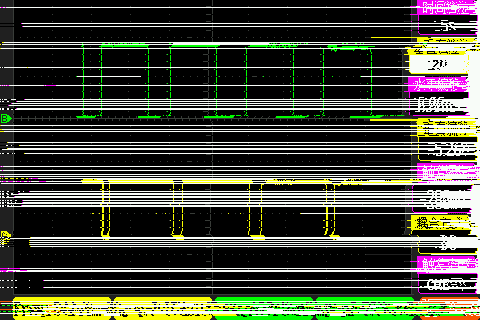

# 标题层级最高
## 标题层级次要
### 标题层级二次要
#### 正文层级 
**尽量不要让标题层级超过四个！！**
#### 正文层级 - 无序列表示范
- 无序列表
	文字详细说明文字详细说明文字详细说明
- 无序列表
	文字详细说明文字详细说明文字详细说明
- 无序列表
	文字详细说明文字详细说明文字详细说明
#### 正文层级 - 有序列表示范
 1. 第一项
	 - 可包含无序列表
	 - 不可包含文字详细说明
	 - 可包含无序列表
	 - 不可包含文字详细说明
 2. 第二项
	 文字详细说明文字详细说明文字详细说明
 3. 第三项
	 文字详细说明文字详细说明文字详细说明
#### 正文层级 - 大段文字
大段文字不需要首行缩进大段文字不需要首行缩进大段文字不需要首行缩进大段文字不需要首行缩进大段文字不需要首行缩进大段文字不需要首行缩进大段文字不需要首行缩进大段文字不需要首行缩进大段文字不需要首行缩进大段文字不需要首行缩进大段文字不需要首行缩进大段文字不需要首行缩进大段文字不需要首行缩进
几句话加一起就是大段文字，一句话不是。几句话加一起就是大段文字，一句话不是。几句话加一起就是大段文字，一句话不是。几句话加一起就是大段文字，一句话不是。几句话加一起就是大段文字，一句话不是。几句话加一起就是大段文字，一句话不是


**加粗加粗加粗加粗** - 高级的标注，可以用于语句

*倾斜倾斜倾斜倾斜* - 低级的标注，可以用于段落，内部可包含**加粗**

~~划掉划掉划掉划掉~~ - 明显的标注，为保证文本整洁，谨慎使用
#### 正文层级 - 代码块
```
需要快速复制的内容，可以直接穿插到列表中
```
#### 正文层级 - 符号说明
1. 中文
	- 除非在大段文字内部，否则不使用句号![enter image description here]
	- 只要包含中文，请使用全宽中文字符 ，。（）《》~·！
	- 语言尽量简洁，可适当使用（）进行注释
2. 英文
	- 第一次出现的缩写请提供释意义
	- 缩写尽量使用全大写 e.g. SHNU
3. 简单逻辑符号
	- | 或 并列
	- & 与 都要满足
	- ‘+’‘-’类似符号请与中文保持前后空格

#### 正文层级 - 插入超链接
[必应搜索（代替百度搜索）](https://www.bing.com/)
%%请直接插入形似https://www.bing.com/的网页链接%%
%%在紧跟的中文全宽括号内简短说明（）%%

#### 正文层级 - 插入图片


%%使用相对路径，图片放置于/assets文件夹内%%

### 编辑器选择
使用任何文本编辑器配合git即可